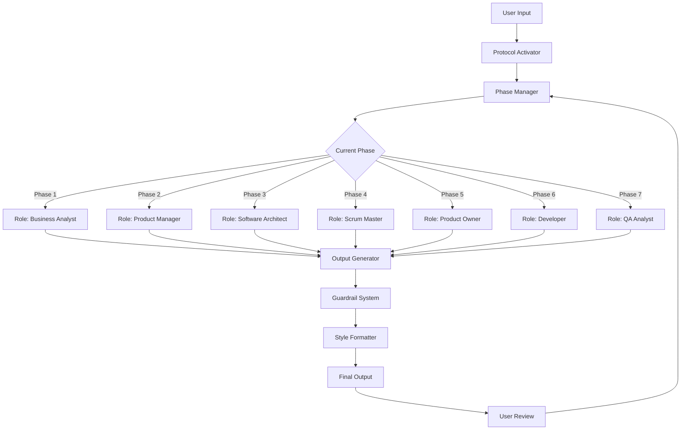

# SaaS Builder Protocol Architecture

The SaaS Builder Protocol works as a structured framework with several key components:

## Key Components

1. **Protocol Activator** - Initializes the protocol and sets the context
2. **Phase Manager** - Ensures phases are followed in sequence
3. **Role Simulator** - Provides appropriate perspective for each phase
4. **Output Generator** - Creates standardized outputs for each phase
5. **Guardrail System** - Prevents phase-skipping and other violations
6. **Style Formatter** - Ensures consistent documentation style
