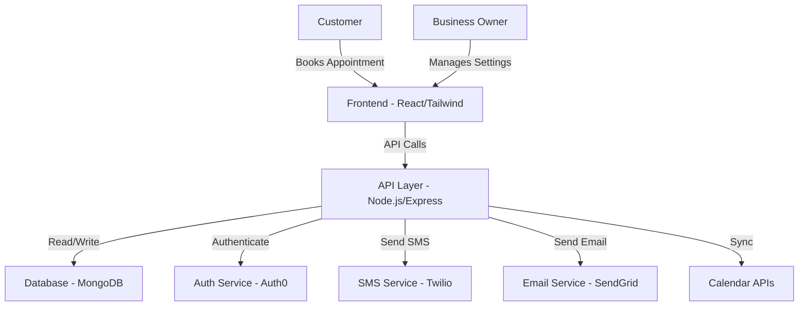

# SaaS Builder Protocol - Role Examples

This document provides complete examples of outputs for each role in the SaaS Builder Protocol, based on a scheduling SaaS application for small businesses.

## Business Analyst (BA) Example

```markdown
## Step 1: Idea Refinement

**Role: Business Analyst (BA)**

**Problem Statement:** 
Small business owners struggle to efficiently manage customer appointments, leading to scheduling conflicts, missed appointments, and reduced revenue. Current solutions are either too complex or too expensive for small businesses.

**User Persona:**
- Primary: Small business owners (1-5 employees) in service industries (hair salons, consultants, tutors)
- Secondary: Customers of these small businesses who need to book and manage appointments

**Goal Summary:**
Create an affordable, simple-to-use appointment scheduling system that reduces missed appointments by 50%, decreases time spent on scheduling by 70%, and integrates with existing calendar systems.
```

## Product Manager (PM) Example

```markdown
## Step 2: Product Design

**Role: Product Manager (PM)**

### SimpleSchedule PRD

**Overview:**
SimpleSchedule is an affordable, easy-to-use appointment scheduling system designed specifically for small businesses. It enables business owners to manage availability, allows customers to self-book appointments, and sends automated reminders to reduce no-shows.

**Key Features:**
1. Business availability management (set hours, breaks, blocked time)
2. Customer-facing booking portal (no account required)
3. Automated email/SMS appointment reminders
4. Calendar integration (Google Calendar, iCal)
5. Basic reporting (appointment volume, no-show rates)

**User Flow:**
1. Business owner sets up available hours and services
2. Business shares unique booking link with customers
3. Customers select service, date, and time
4. System confirms booking and adds to business calendar
5. System sends reminders 24 hours before appointment
6. Post-appointment, system logs completion or no-show

**Constraints:**
- Must work on mobile and desktop browsers
- Must be usable without technical training
- Pricing must be under $20/month for small businesses
- Must not require customer account creation

**Success Metrics:**
- 50% reduction in missed appointments
- 70% decrease in time spent on scheduling
- 90% of appointments booked without owner intervention
- 20% increase in overall appointment volume
```

## Software Architect (Arch) Example

```markdown
## Step 3: System Architecture

**Role: Software Architect (Arch)**

### Architecture Summary:
SimpleSchedule will use a modern web application architecture with a RESTful API backend and a responsive frontend. We'll use a serverless approach for cost-efficiency and scalability, with a NoSQL database to allow for flexible data modeling as requirements evolve.

### Component List:
1. **Frontend Application** - React.js single-page application with Tailwind CSS for responsive design
2. **API Layer** - Node.js with Express, deployed as serverless functions
3. **Database** - MongoDB for storing business profiles, service offerings, and appointments
4. **Authentication Service** - Auth0 for business owner authentication
5. **Notification Service** - Third-party service (Twilio) for SMS reminders
6. **Email Service** - SendGrid for email notifications
7. **Calendar Integration** - Google Calendar API and iCal standard format support

### Architecture Diagram:


## Scrum Master (SM) Example

```markdown
## Step 4: Task Decomposition

**Role: Scrum Master (SM)**

### Epics:

**Epic 1: Business Profile Management**
- **Story 1.1:** Create business profile setup flow
  - AC: Business can set name, description, and contact info
  - AC: Business can upload logo
  - AC: Business can save and edit profile
- **Story 1.2:** Create service management
  - AC: Business can create, edit, and delete services
  - AC: Each service has name, duration, and price
  - AC: Services can be activated/deactivated
- **Story 1.3:** Create availability settings
  - AC: Business can set working hours for each day
  - AC: Business can set recurring breaks
  - AC: Business can block specific dates/times

**Epic 2: Customer Booking Experience**
- **Story 2.1:** Create public booking page
  - AC: Customers can view business profile and services
  - AC: Page is mobile responsive
  - AC: No login required
- **Story 2.2:** Implement appointment selection
  - AC: Customers can select service
  - AC: System shows only available times based on business settings
  - AC: Selected times are temporarily held for 10 minutes
- **Story 2.3:** Create booking confirmation
  - AC: Customers provide name, email, and phone
  - AC: System shows booking summary before confirmation
  - AC: Confirmation page includes add-to-calendar option

**Epic 3: Notification System**
- **Story 3.1:** Create email notifications
  - AC: Business receives email for new bookings
  - AC: Customer receives booking confirmation email
  - AC: Customer receives reminder email 24h before appointment
- **Story 3.2:** Implement SMS notifications
  - AC: Customer receives SMS confirmation if phone provided
  - AC: Customer receives SMS reminder 24h before appointment
  - AC: SMS contains appointment details and cancellation link

**Epic 4: Calendar Integration**
- **Story 4.1:** Implement Google Calendar integration
  - AC: Business can connect Google Calendar
  - AC: Appointments sync to Google Calendar
  - AC: Google Calendar blocked times prevent double booking
- **Story 4.2:** Create iCal feed
  - AC: Business has access to iCal feed URL
  - AC: iCal feed contains all appointments
  - AC: Feed updates when appointments change
```

## Product Owner (PO) Example

```markdown
## Step 5: Task Planning

**Role: Product Owner (PO)**

### Task List:

**Task 1: Set up project infrastructure**
- **Description:** Initialize repository, set up CI/CD, configure database, and deploy initial skeleton
- **Est. Time:** 1 day
- **Tooling:** GitHub, Vercel, MongoDB Atlas, NextAuth.js

**Task 2: Implement business profile setup**
- **Description:** Create forms and backend APIs for business profile management
- **Est. Time:** 2 days
- **Tooling:** React Hook Form, Express.js, MongoDB

**Task 3: Build service management module**
- **Description:** Create CRUD functionality for services with validation
- **Est. Time:** 2 days
- **Tooling:** React, Express.js, MongoDB

**Task 4: Develop availability settings**
- **Description:** Create calendar UI for setting business hours and managing blocked times
- **Est. Time:** 3 days
- **Tooling:** FullCalendar.js, React, Express.js

**Task 5: Create public booking page**
- **Description:** Develop customer-facing booking flow with responsive design
- **Est. Time:** 3 days
- **Tooling:** React, Tailwind CSS, date-fns

**Task 6: Implement notification system**
- **Description:** Set up email and SMS notification templates and triggers
- **Est. Time:** 2 days
- **Tooling:** SendGrid, Twilio, Node.js

**Task 7: Build calendar integrations**
- **Description:** Implement Google Calendar sync and iCal feed generation
- **Est. Time:** 2 days
- **Tooling:** Google Calendar API, ical-generator, Node.js

The smallest testable version of this would be Tasks 1, 2, 3, and 5, which would allow a business to create a profile, define services, and let customers book appointments, even without calendar integration or notifications.
```

## Developer (Dev) Example

```markdown
## Step 6: Implementation

**Role: Developer (Dev)**

I'll implement the service management module which is critical for the MVP. This includes creating, updating, and deleting services that customers can book.

### Service Model Implementation:

```javascript
// models/Service.js
const mongoose = require('mongoose');

const ServiceSchema = new mongoose.Schema({
  businessId: {
    type: mongoose.Schema.Types.ObjectId,
    ref: 'Business',
    required: true
  },
  name: {
    type: String,
    required: [true, 'Please provide a service name'],
    trim: true,
    maxlength: [50, 'Name cannot be more than 50 characters']
  },
  description: {
    type: String,
    maxlength: [500, 'Description cannot be more than 500 characters']
  },
  duration: {
    type: Number,
    required: [true, 'Please specify the duration in minutes'],
    min: [5, 'Duration must be at least 5 minutes']
  },
  price: {
    type: Number,
    required: [true, 'Please specify the price'],
    min: [0, 'Price cannot be negative']
  },
  isActive: {
    type: Boolean,
    default: true
  },
  createdAt: {
    type: Date,
    default: Date.now
  }
});

module.exports = mongoose.model('Service', ServiceSchema);
```

### API Endpoints:

```javascript
// routes/services.js
const express = require('express');
const router = express.Router();
const { protect } = require('../middleware/auth');
const Service = require('../models/Service');

// Get all services for a business
router.get('/', protect, async (req, res) => {
  try {
    const services = await Service.find({ businessId: req.user.businessId });
    res.status(200).json({ success: true, data: services });
  } catch (error) {
    res.status(500).json({ success: false, error: error.message });
  }
});

// Create a new service
router.post('/', protect, async (req, res) => {
  try {
    req.body.businessId = req.user.businessId;
    const service = await Service.create(req.body);
    res.status(201).json({ success: true, data: service });
  } catch (error) {
    res.status(400).json({ success: false, error: error.message });
  }
});

// Get, update and delete service routes omitted for brevity...

module.exports = router;
```

### React Component for Service Management:

```jsx
// components/ServiceForm.jsx
import React, { useState } from 'react';
import { useForm } from 'react-hook-form';

export default function ServiceForm({ onSubmit, initialData = {} }) {
  const { register, handleSubmit, formState: { errors } } = useForm({
    defaultValues: initialData
  });
  
  return (
    <form onSubmit={handleSubmit(onSubmit)} className="space-y-4">
      <div>
        <label className="block text-sm font-medium text-gray-700">
          Service Name
        </label>
        <input
          type="text"
          {...register('name', { required: 'Name is required', maxLength: 50 })}
          className="mt-1 block w-full rounded-md border-gray-300 shadow-sm"
        />
        {errors.name && (
          <p className="mt-1 text-sm text-red-600">{errors.name.message}</p>
        )}
      </div>
      
      {/* Other form fields omitted for brevity */}
      
      <div className="flex justify-end">
        <button
          type="submit"
          className="px-4 py-2 bg-blue-600 text-white rounded-md hover:bg-blue-700"
        >
          Save Service
        </button>
      </div>
    </form>
  );
}
```

### Setup Instructions:
1. Install dependencies: `npm install mongoose express-validator react-hook-form`
2. Add the Service model to your models directory
3. Add the services routes to your API routes
4. Import and use the ServiceForm component in your admin interface

### Test Plan:
- Unit test the Service model validation
- API tests: Create, read, update, delete services
- UI tests: Form submission, validation errors, list display
- Integration test: Create service and verify it appears in booking form
```

## QA Analyst Example

```markdown
## Step 7: QA Loop

**Role: QA Analyst**

### Feedback:

**Issues:**
- The service form doesn't validate minimum duration (5 minutes) in the frontend, though it's enforced in the model
- Error handling in the API doesn't provide user-friendly messages for validation failures
- The service listing doesn't include pagination, which could be problematic for businesses with many services
- Active/inactive toggle functionality is missing from the UI implementation

**Risks:**
- No rate limiting on API could lead to abuse
- No input sanitization could expose the application to XSS attacks
- Without proper indexing, database queries might slow down as the service count grows
- The duration field accepts any number, but should probably only accept standard increments (15, 30, 45, 60 minutes)

**Polish Suggestions:**
- Add a preview capability to see how services will appear on the booking page
- Include drag-and-drop reordering for services to control display order
- Add a duplicate button to quickly create similar services
- Implement color coding or tagging to help organize services
- Consider adding service categories to improve organization for businesses with many services
```
